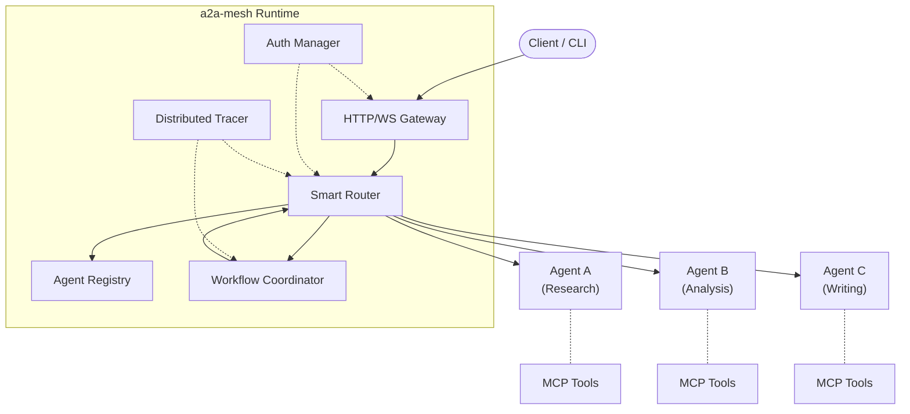

# a2a-mesh

[](https://github.com/sushaan-k/a2a-mesh/actions/workflows/ci.yml)
[](https://python.org)
[](LICENSE)
[](https://pypi.org/project/a2a-mesh/)

**Lightweight multi-agent coordination runtime using the A2A protocol.**

The agent protocol stack is standardized --- MCP for tools, A2A for agent-to-agent communication --- but there is no runtime that ties it together. `a2a-mesh` fills that gap: a minimal, async-native Python runtime that handles discovery, routing, orchestration, auth, and observability for multi-agent systems.

Think of it as **Kubernetes for agents**, but small enough to read in an afternoon.

---

## Why a2a-mesh?

| Problem | a2a-mesh Solution |
|---|---|
| Agents can't find each other | **Registry** with capability-based discovery and health monitoring |
| No intelligent task routing | **Smart Router** with cost-aware, latency-aware, load-balanced routing |
| Building multi-agent workflows is painful | **Workflow DAGs** with fan-out, fan-in, and consensus |
| Agent-to-agent auth is unsolved | **Scoped JWT tokens** with audit logging |
| No visibility into agent interactions | **OpenTelemetry tracing** with per-span cost tracking |

---

## Quick Start

### Install

```bash
pip install a2a-mesh
```

### Python API

```python
import asyncio
from a2a_mesh import Mesh, AgentCard, Task, Workflow

async def main():
    # Start a mesh
    mesh = Mesh(port=8080)

    # Register agents
    mesh.register(AgentCard(
        name="research-agent",
        description="Web research and synthesis",
        url="http://localhost:9001",
        capabilities=["web_search", "summarization"],
        cost_per_task=0.02,
    ))
    mesh.register(AgentCard(
        name="writing-agent",
        description="Writes reports and articles",
        url="http://localhost:9002",
        capabilities=["writing", "formatting"],
        cost_per_task=0.01,
    ))

    # Dispatch a single task (routed by capability)
    result = await mesh.dispatch(
        "Summarize recent advances in quantum computing",
        required_capabilities=["web_search", "summarization"],
    )

    # Or run a multi-step workflow
    workflow = Workflow(
        name="research-pipeline",
        tasks=[
            Task(name="research", agent="research-agent", input="quantum computing"),
            Task(name="write", agent="writing-agent", depends_on=["research"]),
        ],
    )
    result = await mesh.execute_workflow(workflow)
    print(result.task_results)

    await mesh.stop()

asyncio.run(main())
```

### CLI

```bash
# Start the mesh gateway
a2a-mesh start --host 0.0.0.0 --port 8080

# Register an agent from a JSON card
a2a-mesh register --card agent_card.json --endpoint http://localhost:9001

# List registered agents
a2a-mesh agents

# Dispatch a task
a2a-mesh dispatch "Analyze Q4 earnings for AAPL" -c financial_analysis

# View traces
a2a-mesh traces --last 10

# Launch the monitoring dashboard
a2a-mesh dashboard --host 0.0.0.0
```

---

## Architecture



### Core Components

| Component | Role |
|---|---|
| **Agent Registry** | Service discovery with capability indexing, health checks, version management; Redis-backed via `RedisAgentRegistry` |
| **Smart Router** | Routes tasks to agents via round-robin, least-cost, least-latency, least-load, random, or custom hook strategies |
| **Workflow Coordinator** | Executes DAG workflows with fan-out/fan-in parallelism and multi-agent consensus |
| **Auth Manager** | JWT-based scoped token exchange with full audit trail |
| **Distributed Tracer** | OpenTelemetry spans with per-operation cost tracking |
| **HTTP/WS Gateway** | Starlette-based JSON-RPC 2.0 ingress with rate limiting over HTTP or WebSocket |
| **MCP Bridge** | Connects agents to MCP tool servers |

---

## Routing Strategies

```python
from a2a_mesh import RoutingPolicy, RoutingStrategy

# Cost-optimized routing
policy = RoutingPolicy(
    strategy=RoutingStrategy.LEAST_COST,
    fallback="any_capable",
    max_queue_depth=50,
)

# Available strategies:
# - ROUND_ROBIN   : Cycle through capable agents
# - LEAST_COST    : Pick the cheapest agent
# - LEAST_LATENCY : Pick the fastest agent
# - LEAST_LOAD    : Pick the least busy agent
# - RANDOM        : Random selection

# For custom ranking, pass a `strategy_hook` callable to `Router`.
```

---

## Workflow DAGs

Workflows are directed acyclic graphs with support for fan-out parallelism, fan-in aggregation, and multi-agent consensus.

```python
from a2a_mesh import Workflow, Task, ConsensusConfig, ConsensusThreshold, FanInStrategy

workflow = Workflow(
    name="review-pipeline",
    tasks=[
        Task("research", agent="researcher", input="quantum computing"),
        Task("analyze", agent="analyst", depends_on=["research"]),
        Task("draft", agent="writer", depends_on=["analyze"]),
        Task("review", required_capabilities=["review"], depends_on=["draft"]),
    ],
    fan_out={"research": 3},                           # 3 parallel researchers
    fan_in={"research": FanInStrategy.MERGE},           # Merge their results
    consensus={
        "review": ConsensusConfig(agents=2, threshold=ConsensusThreshold.ALL_AGREE),
    },
)
```

---

## Authentication

Scoped JWT token exchange for agent-to-agent delegation:

```python
from a2a_mesh import AuthManager

auth = AuthManager()

# Agent A delegates read access to Agent B
token = auth.issue_token(
    issuer="agent-a",
    subject="agent-b",
    scopes=["data:read", "search:execute"],
)

# Agent B presents the token; mesh validates it
claims = auth.validate_token(token.token, required_scopes=["data:read"])

# Full audit trail
for entry in auth.get_audit_log():
    print(f"{entry.timestamp} {entry.action} {entry.issuer} -> {entry.subject}")
```

---

## Observability

Built-in OpenTelemetry tracing with cost tracking:

```python
mesh = Mesh(port=8080)

# After running tasks...
for span in mesh.traces(limit=10):
    print(f"[{span.operation}] agent={span.agent_name} "
          f"duration={span.duration_ms:.1f}ms cost=${span.cost:.4f}")

# Total cost across all operations
print(f"Total spend: ${mesh.tracer.total_cost():.4f}")
```

The mesh gateway exposes a `/traces` endpoint, and the built-in dashboard provides a web UI at `/`.

---

## Project Structure

```
a2a-mesh/
├── src/a2a_mesh/
│   ├── __init__.py          # Public API exports
│   ├── mesh.py              # Main runtime
│   ├── registry.py          # Agent registration + discovery
│   ├── router.py            # Task routing
│   ├── coordinator.py       # Workflow orchestration
│   ├── auth.py              # JWT token exchange
│   ├── tracer.py            # OpenTelemetry integration
│   ├── gateway.py           # HTTP gateway
│   ├── cli.py               # CLI interface
│   ├── protocol/
│   │   ├── a2a.py           # A2A protocol (JSON-RPC)
│   │   └── mcp.py           # MCP bridge
│   └── dashboard/
│       └── app.py           # Web dashboard
├── tests/                   # pytest + pytest-asyncio
├── examples/
│   ├── research_workflow.py
│   ├── code_review_pipeline.py
│   └── customer_support.py
└── docs/
```

---

## Development

```bash
# Clone and install
git clone https://github.com/sushaan-k/a2a-mesh.git
cd a2a-mesh
pip install -e ".[dev]"

# Run tests
pytest -v

# Lint + format
ruff check src/ tests/
ruff format src/ tests/

# Type check
mypy src/a2a_mesh/
```

---

## Contributing

Contributions are welcome. Please open an issue to discuss significant changes before submitting a pull request.

1. Fork the repository
2. Create a feature branch (`git checkout -b feature/amazing-thing`)
3. Write tests for your changes
4. Ensure all checks pass (`pytest`, `ruff`, `mypy`)
5. Submit a pull request

---

## License

MIT License. See [LICENSE](LICENSE) for details.
